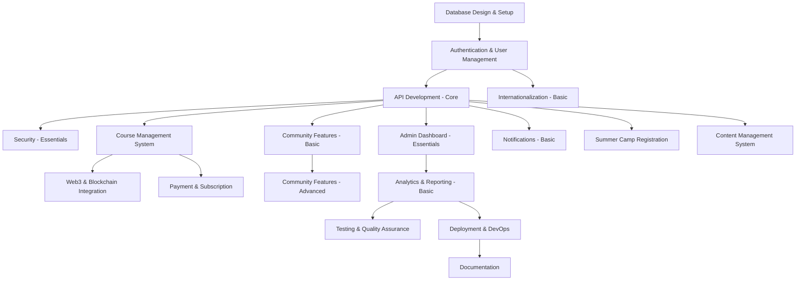

# 🧠 WAGA Academy Backend Implementation – Prioritized Roadmap

This document outlines a phased roadmap to implement the backend for the WAGA Academy platform. Prioritization is based on:

1. Core functionality requirements  
2. Technical dependencies  
3. User value delivery  
4. Implementation complexity  

---

## 🔗 High-Level Dependencies

Let's visualize the dependencies between major backend components:

---

## 🚀 Prioritized Implementation Plan

### ✅ Phase 1: Foundation (Weeks 1–4)

- **Database Design & Setup**
  - Schema design for core entities
  - Migration system
  - Data validation rules
  - Connection pooling

- **Authentication & User Management**
  - JWT implementation
  - Registration/login
  - Role-based access control
  - Password reset flow

- **API Development – Core**
  - RESTful API implementation
  - Versioning & error handling
  - API authentication

- **Security – Essentials**
  - Input validation/sanitization
  - CSRF/XSS protection
  - Encryption (at rest & in transit)
  - Security headers

---

### 🧩 Phase 2: Core Features (Weeks 5–10)

- **Course Management System**
  - CRUD APIs
  - Enrollment
  - Content modules
  - Progress tracking

- **Community Features – Basic**
  - Forum topics/categories
  - Event APIs
  - Resource file storage
  - Basic access control

- **Admin Dashboard – Essentials**
  - Admin login
  - User/course/system tools

- **Notifications – Basic**
  - Email alerts
  - Notification settings
  - Template system

---

### ⚙️ Phase 3: Enhanced Features (Weeks 11–16)

- **Payment & Subscription**
  - Gateway integrations
  - Subscription & billing
  - Refund processing

- **Summer Camp Registration**
  - Application & review workflows
  - Payment integration
  - Communication system

- **Content Management System**
  - Static content APIs
  - Media storage
  - SEO metadata

- **Analytics & Reporting – Basic**
  - KPI dashboards
  - User logs & activity

---

### 🔬 Phase 4: Advanced Features (Weeks 17–24)

- **Web3 & Blockchain Integration**
  - Wallet connectivity
  - Smart contract interactions
  - On-chain certificates

- **Community Features – Advanced**
  - Moderation tools
  - Gamification
  - Analytics

- **Performance & Scalability**
  - Redis, CDN, query optimization
  - Load balancing

- **Internationalization – Basic**
  - Multi-language support
  - Timezone & region handling

---

### 🛠️ Phase 5: Optimization & Expansion (Weeks 25–32)

- **Testing & Quality Assurance**
  - Unit/integration/load/API testing

- **Deployment & DevOps**
  - CI/CD pipelines
  - Monitoring & centralized logging
  - Disaster recovery

- **Documentation**
  - API, database, system, deployment

- **Advanced Features**
  - 2FA
  - Real-time chat
  - Feature flag system

---

## ✅ Implementation Recommendations

- Start with **monolith architecture** → later refactor into microservices
- Use **feature flags** to gradually roll out new features
- Implement **automated testing** early
- Use **infrastructure as code (IaC)** to manage environments
- Add **monitoring and logging** from the start

---

This phased approach ensures scalable delivery, early value, and robust performance for the WAGA Academy backend.
